Nu til den egentlige vejledning, som er en skalerbar skabelon, der er sat op til at hjælpe OS2 projekter og produkter med at bygge gode overskuelige dokumentationssider.
Skabelonen hjælper med en hurtig opstart og understøtter en stabil struktur.

    

### Trin for trin

 

  
<strong>Trin 1: OS2 hovedorganisation på GitHub</strong>

  
Her finder du flere repository:

  <ol>
    <li>OS2 Handbook</li>
    <li>Governance Report</li>
    <li>Documentation template</li>
  </ol>
   
  
Den sidste er den, vi bruger i denne vejledning.

 <a href="https://github.com/OS2offdig">Gå til OS2s hovedorganisation</a>

 

  
<strong>Trin 2: Vælg den rigtige skabelon</strong>

  
Scroll ned (helt ned på siden) og vælg/tryk OS2-docs-template repository’et.

   
    
  

 

  
<strong>Trin 3: Opret repository</strong>

  
Når du er kommet ind på repository’et:

  
Tryk på [Use this template] i øverste højre hjørne og vælg: Create a new repository

   
  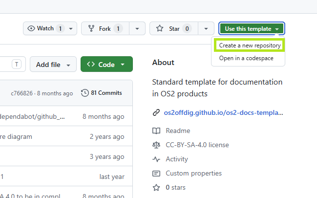  
  

 

  
<strong>Trin 4: Vælg ejer til repository'et</strong>

  
Der skal vælges en owner til det nye repository – det kan være din produktorganisation. I nedenstående eksempel er det OS2valghalla.

  
Giv et navn – det kan være produktnavnet efterfulgt af navnet. Navnet skal være uden mellemrum, brug i stedet ’–’

  
Der kan også tilføjes en beskrivelse, men det er ikke obligatorisk, og kan gøres senere.

  
Vælg ’Public under Configuration, det kan også gøres senere, men er nemmest at gøre med det samme.

  
Sitet skal være konfigureret som ’Public’ for at kunne udgives og være synligt.

   
  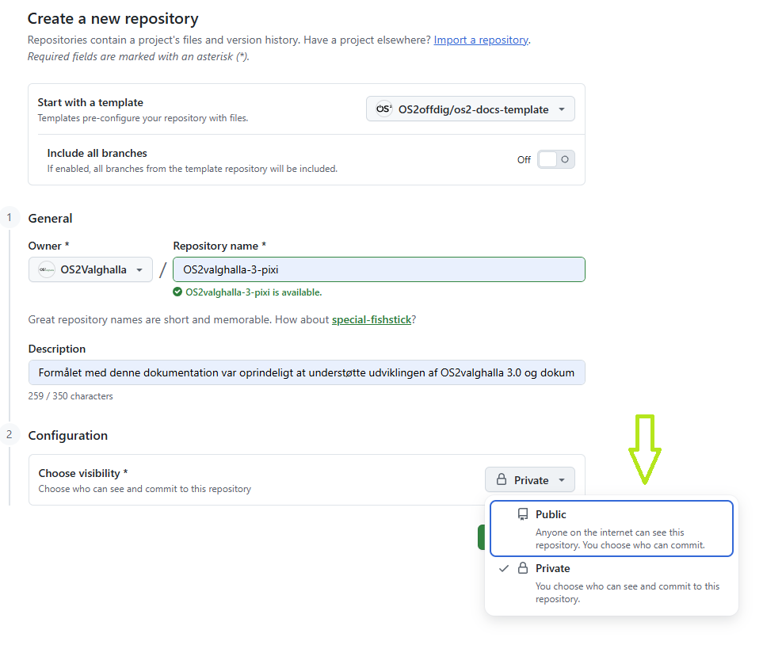  
  

 

  
<strong>Trin 5: Byg repository'et</strong>

  
Klik på: Create Repository – efter et lille stykke tid er der oprettet et repository under den valgte ’owner’ (i dette eksem OS2valghalla).

   
  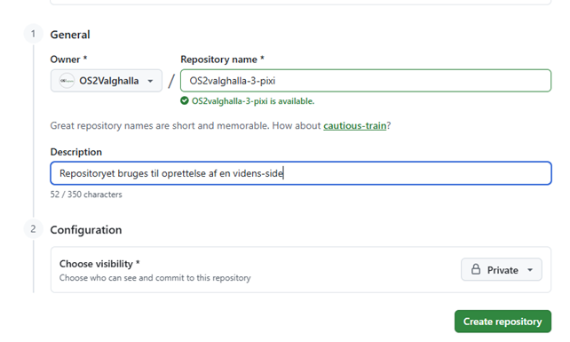  
  
Der kommer muligvis en fejlbesked på mail:

  
’[OS2Valghalla/OS2valghalla-3-pixi] Run failed: Deploy Jekyll site to Pages’

  
<strong>Se bort fra den for nu.</strong>

  

 

  
<strong>Trin 6: Open Source licens</strong>

  
Nedenfor ses det ’rå’ repository, tryk på LICENSE filen, for at tjekke, at det er den rigtige.

  
Det skal være: <strong>Creative Commons Attribution Share Alike 4.0 International</strong>

   
  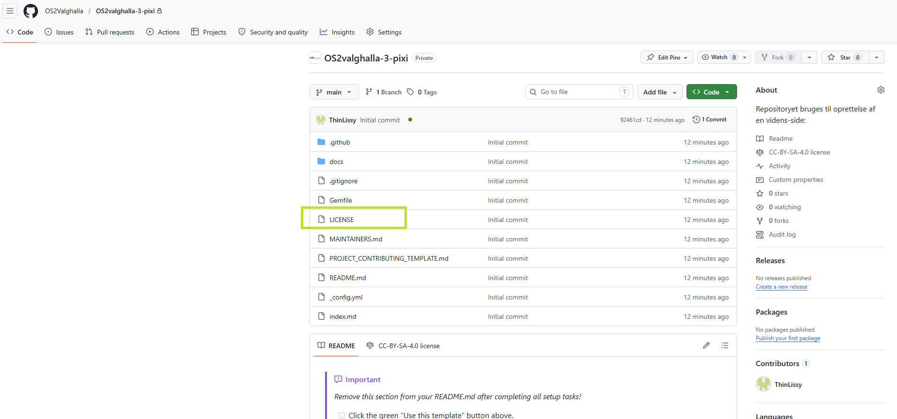  
  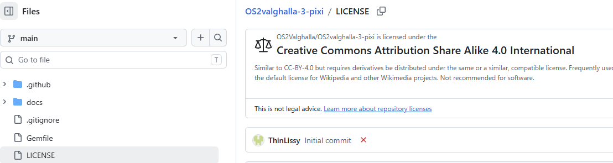  

 

  
<strong>Trin 7: Klargør Pages</strong>

  
Klik på Settings og vælg Pages i sidemenuen.
 

  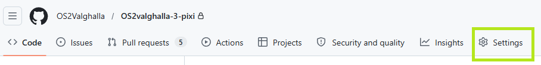  
  
Under ’Build and deploy’ vælges GitHub Actions:
 
  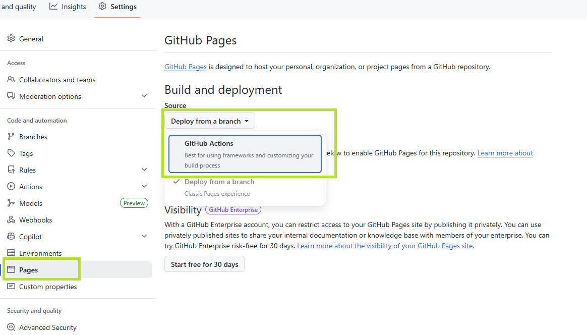  
  
Nu er opsætningen blevet klargjort til at bygge siderne gennem GitHub Actions. Siderne bliver ikke bygget endnu - der skal laves en tilføjelse til _config.yml filen, se trin 8.

 

  
<strong>Trin 8: Færdiggør bygning af siden</strong>

  
Tryk på <> Code i topmenuen:
 

  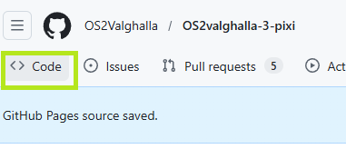  
  
Vælg herefter _config.yml filen i repository'ets rod/root directory:
 
  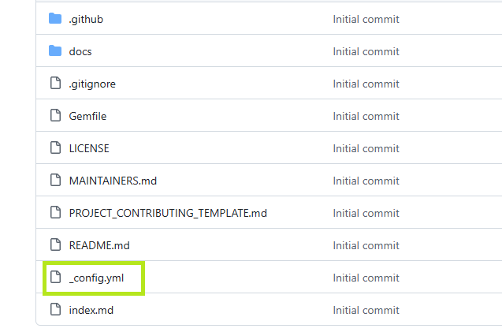  
  
Der skal laves en tilføjelse til standard filen, så siderne bygges. Her kan titel og beskrivelse også ændres.

  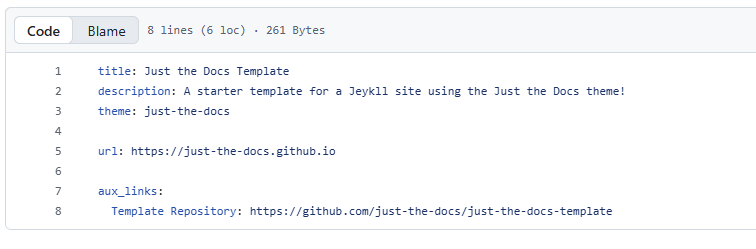  

  
Tilføjelse (tryk på blyanten i fil-headeren for at redigere):    
  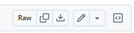
  

  
Indsæt følgende kode nederst i filen:

  <pre><code class="language-yaml">
  defaults:
  - scope:
      path: ""         # alle filer i hele repoet
      type: "pages"    # markdown-sider
    values:
      layout: "default"
      has_toc: false # fjerner overordnet 'Table of contents'. has_toc kan sættes til true her eller i headeren på de individuelle sider
  </code></pre> 
  
Det er nødvendigt at være omhyggelig med indrykningerne i .yml-filen, da disse har betydning. Det vil give fejl, hvis de ikke er korrekte.

  
Klik på [Commit changes], når filen er ændret.
 

  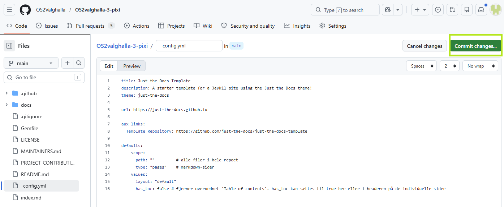  
  
Skriv gode commit-beskrivelser, så det er muligt senere let at se hvilke ændringer, der er foretaget og evt. hvorfor.
 
  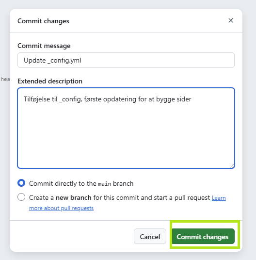  
  
Vælg: Commit changes.

 

  
<strong>Trin 9: Følg med i dit commit</strong>

  
Du kan klikke på [Actions] for at følge med i, hvor lang commit’et er kommet. Den brune prik indikerer at commit’et stadigt er i gang, grøn prik at det er gået igennem og rød prik, at der er opstået en fejl.
 

  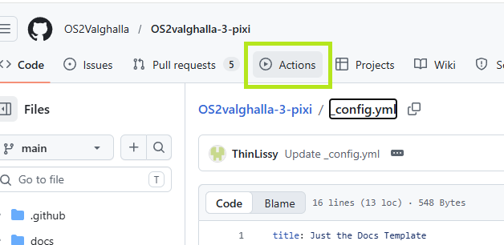  
  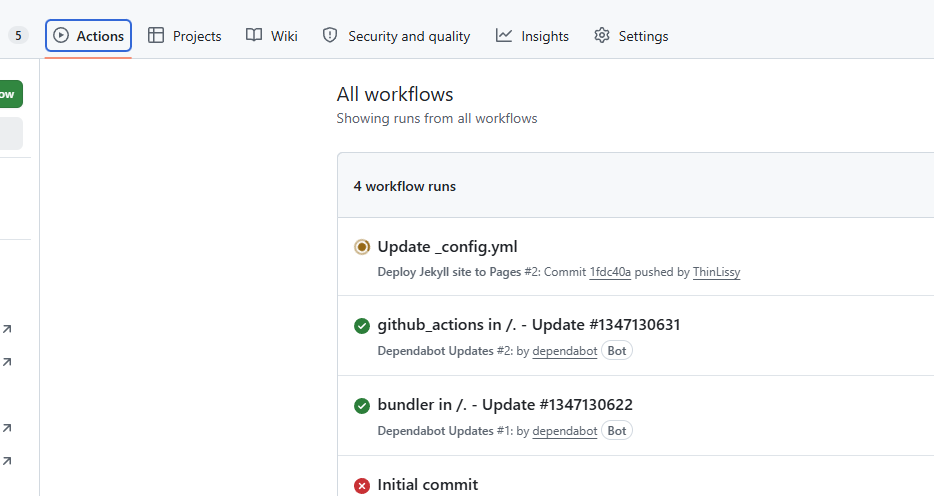  
  
Det tager et lille stykke tid. Hvis der opstår en fejl, er der en uddybende beskrivelse af denne, hvis man tilgår bygget (tryk på det).

  
Nedenfor har _config-filen bygget med succes:
 

  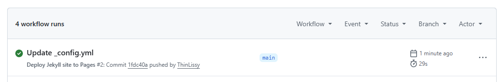   

 

  
<strong>Trin 10: Adresselink (URL)</strong>

  
Gå nu tilbage til: Settings og vælg Pages

  
Siden er nu bygget og har fået en <strong>url</strong>:
 

  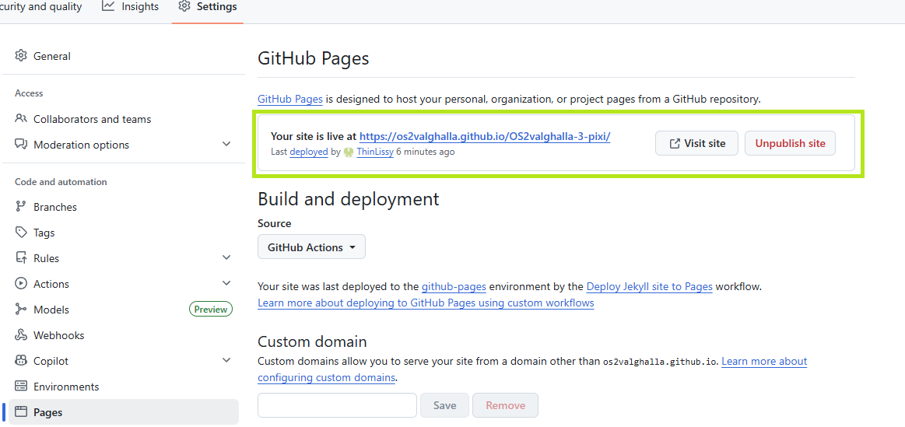  

  
Tryk på url’en og se siden.
 

  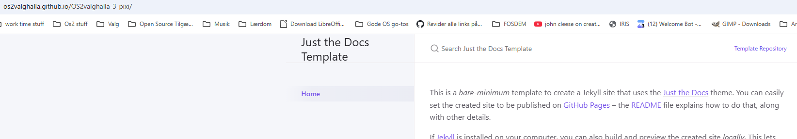   

 

  
<strong>Trin 11: Ret indexfilen til og angiv titel</strong>

  
En index-fil er systemets startpunkt. Den åbnes først og sørger for at vise den rigtige side eller starte den relevante funktionalitet ved at samle forbindelsen til de øvrige filer og komponenter.

  
Tryk på <> Code i topmenuen og vælg index.md i sidemenuen.
 

  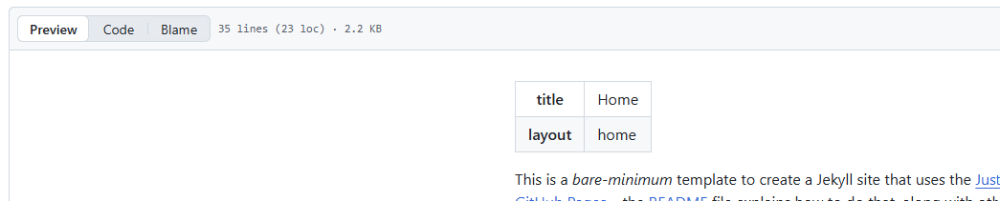  

  
Vælg blyanten for at redigere filen. Egenskaber, titel og tekst mv. kan ændres her.
 

  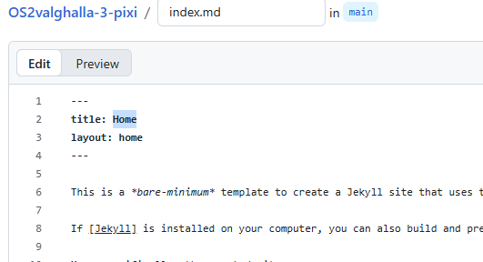  
  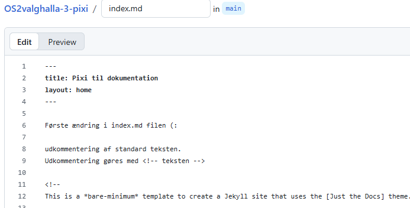   
  
Tryk <strong>’Commit changes’</strong> og tilføj en beskrivende tekst.

  
Igen kan ’bygget’ ses under Actions.
 
  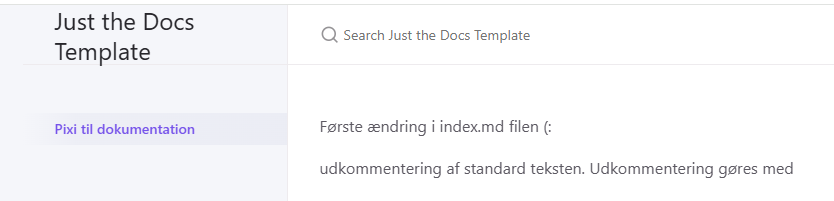  

  
Udkommentering gøres med: &lt;!-- teksten der skal udkommenteres --&gt;

  
På ’logo-pladsen’ står der stadig: Just the Docs Template. Dette ændres i _config.yml-filen.

  
Vælg <> Code i topmenuen og åbn _config.yml

  
Vælg blyanten for at redigere og ændr titel og beskrivelse.

  
Det er også muligt at lægge et logo her.
 

  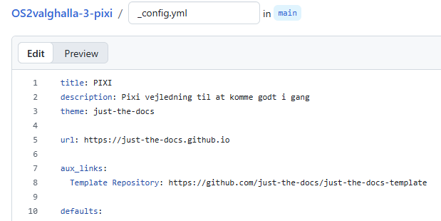  
  
Commit changes…
 
  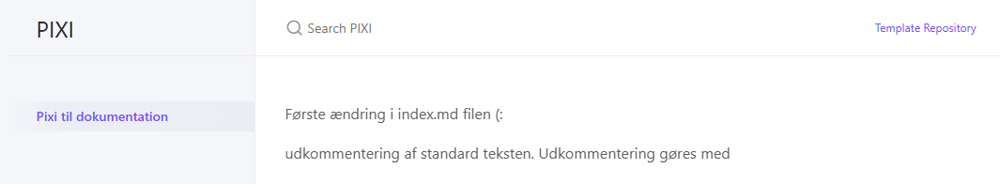  

 

  
<strong>Trin 12: Opret filer og mapper</strong>

  
Vælg: <> Code og tryk på mappen: docs

  
Herfra kan der oprettes filer og mapper. En mappe kan ikke være tom på GitHub, så man opretter den første fil samtidig med mappen (se markeret tekst længere nede på siden.
 

  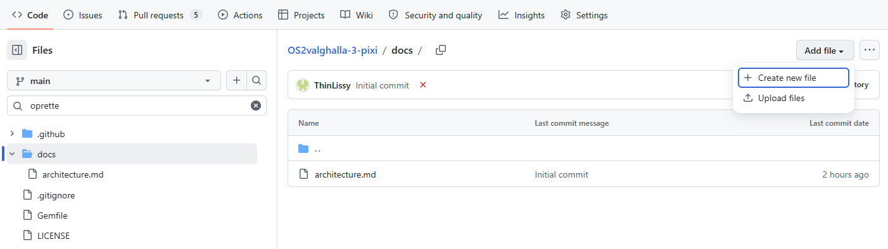  

  
Tryk på: Create new file for at oprette filer.
 

  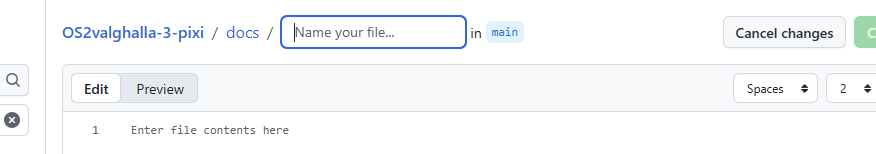  
  
Skriv navnet på filen og husk .md som filtype. Består navnet af flere ord, deles de med  underscore, fx: <mark>my_first_page.md</mark>

  
Tryk ’Commit changes’ og lav en god beskrivelse.
 
  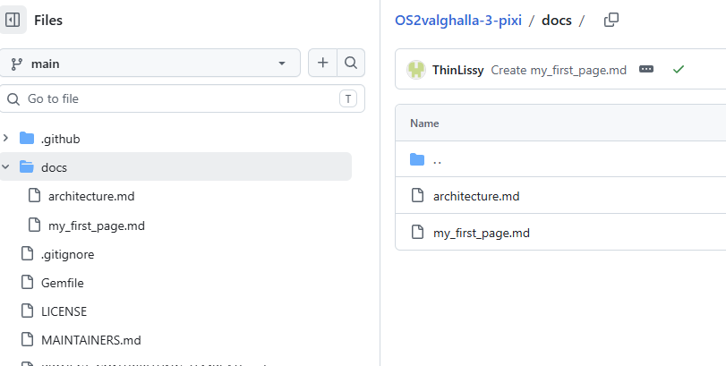  
  
<strong>For at lave en mappe:</strong>

  
Tryk på: Create new file for at oprette mapper.

  
I feltet angives mappe navn, lav slash og skriv filnavnet på filen, fx: <mark>ny_mappe/fil.md</mark>

  
<strong>OBS</strong>: Der skal oprettes en fil i mappen, før den kan oprettes.

  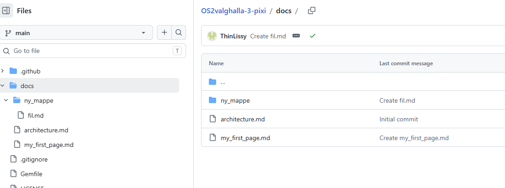  

 